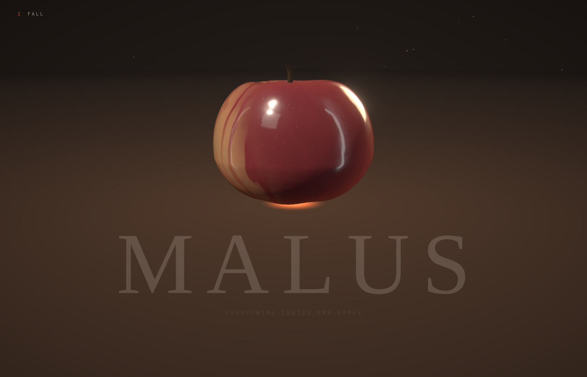
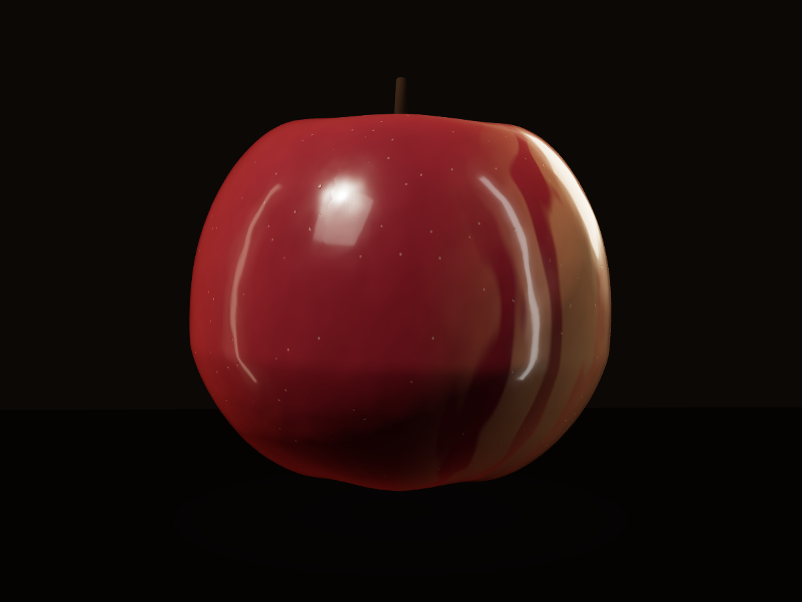

# MALUS

**A 3D essay about an apple. Nothing in it was downloaded.**

Latin `mālus` means apple tree. `malus` means evil. The two words differ only in
a vowel length that Latin stopped writing down — which is very likely why the
unnamed fruit in Genesis became an apple. A pun turned into two thousand years
of iconography.

That is the whole thesis of this site: the apple is the most ordinary object in
the world, and it is full of things you were never told.

---

## The idea

Most 3D showcases pick a subject that is already impressive — a spaceship, a
supercar, a fantasy city. The subject does half the work.

So this one takes the least impressive object available and tries to earn the
same reaction anyway. Six acts, one fruit, and a rule that every act has to
teach you exactly one thing that corrects something you believed.

The research came first. Before a line of shader code, 228 papers were pulled
from arXiv and OpenAlex across three axes — material rendering, perception
psychology, and the botany and chemistry of the fruit — and three findings
changed the design outright:

**1. Gloss has dedicated neurons.** Cells in the inferior temporal cortex are
selectively tuned to gloss along exactly three physical reflectance parameters:
specular reflectance, diffuse reflectance, and the spread of the specular lobe.
So the skin shader exposes those three by name — `uRhoS`, `uRhoD`, `uAlpha` —
instead of "roughness" and "metalness". Act II drives them directly. We are not
adjusting a material; we are moving through a perceptual space the brain
built hardware for.

**2. Crisp and mealy are not freshness.** They are two different ways for a
crack to travel. In a crisp apple the fracture runs *through* the cells, which
burst under turgor pressure and release juice. In a mealy one it runs *between*
them, along the middle lamella, leaving the cells intact and dry. Same fruit,
same fracture, one parameter. Act III makes that parameter a slider.

**3. Domestication ran the other way.** It is best modelled as a natural
evolutionary response to herbivory: plants recruited humans as seed dispersers.
The apple got sweet, large and red because that attracted a species that would
carry it across continents. It was a trade — sugar for distribution.

> You were never the farmer. You were the deal.

That sentence is the turn the second half of the piece is built around, and it
is why the act about lost cultivars lands as a broken bargain rather than as
nostalgia.

---

## The acts

| | Act | What happens |
|---|---|---|
| I | **FALL** | Scrolling *is* gravity — distance falls with the square of scroll, so speed rises linearly. The apple accelerates because you do. |
| II | **SKIN** | Macro. The shine is not polish: the cuticle is an organ that turns ultraviolet light into heat instead of damage. |
| III | **BITE** | Real-time fracture. One slider — turgor — decides whether the crack goes through the cells or around them. |
| IV | **STAR** | Cut across the equator, five carpels make a star. |
| V | **TIME** | The cut face browns as you scroll. It is not rot; polyphenol oxidase is an immune response. A drop of ascorbic acid reverses it. |
| VI | **ORCHARD** | Ten thousand genetically distinct apples, then the dark. Every named variety is one tree, copied. |

---

## Screenshots

| | |
|---|---|
|  |  |
| *Act I — falling through the dark* | *Act I — landing, and the title arrives with it* |


*The apple: procedural geometry, procedural skin. No mesh was imported, no texture was loaded.*

---

## Nothing was downloaded

The hackathon rules require participants to hold the rights to every asset they
include. This project resolves that by not having any.

- **The apple's shape** is a deformed icosphere: a silhouette profile, a
  five-lobe modulation from the five carpels, two cavities placed as functions
  of distance from the axis, and gradient noise for the lopsidedness no real
  fruit is without. Seeded — the same seed grows the same apple, which is what
  makes act VI's ten thousand distinct apples possible.
- **The skin** is written in GLSL: an anthocyanin blush laid over a yellow-green
  ground colour (not a gradient between them — that produces a peach), varietal
  striping that only exists in the transition band where real striping lives,
  lenticels from a cellular noise field, russeting in the cavities, and
  derivative-based relief so highlights wobble as they travel.
- **The lighting** is a lightformer rig baked into a procedural environment map.
  No HDRI, no CDN, nothing to go missing on deploy.
- **The noise** is written from the definition rather than pulled from a
  library, so even that carries no obligation.

One consequence worth naming: `three-pinata`, the obvious off-the-shelf answer
for mesh fracture, has no licence file — which makes it "all rights reserved"
and unusable here. Act III's fracture is written from scratch. That turned out
to be the better outcome anyway, because an off-the-shelf shatter cannot express
the crisp/mealy distinction that the act is about.

---

## Built with

- **[three.js](https://github.com/mrdoob/three.js)** · **[React Three Fiber](https://github.com/pmndrs/react-three-fiber)** · **[drei](https://github.com/pmndrs/drei)** — scene graph
- **[three-custom-shader-material](https://github.com/FarazzShaikh/THREE-CustomShaderMaterial)** — injecting the skin shader into a physically based material so it keeps real image-based lighting
- **[postprocessing](https://github.com/pmndrs/postprocessing)** — bloom, chromatic aberration, vignette
- **[Rapier](https://github.com/dimforge/rapier.js)** — physics
- **[Lenis](https://github.com/darkroomengineering/lenis)** + **[GSAP](https://github.com/greensock/GSAP)** — the scroll spine
- **[Tone.js](https://github.com/Tonejs/Tone.js)** — procedural audio
- **[Zustand](https://github.com/pmndrs/zustand)** — state
- **Vite** · **React** · **TypeScript**
- **[Playwright](https://playwright.dev)** with SwiftShader — headless WebGL 2.0 capture, so the scene could actually be looked at during development rather than guessed at

Built with **Claude Opus** as the developer. That is part of the point: the
author does not write shader code. Every line here was produced through an AI
agent working from a research brief — and the interesting part is not that it
compiled, but that it took visual verification to find the bugs. A floor that
was accidentally parented to the falling apple, and therefore sliced the fruit
in half at its own equator, looks completely correct in source.

---

## Running it

```bash
cd app
npm install
npm run dev      # http://localhost:5273
```

Capture a frame headlessly (no GPU required):

```bash
node tools/shot.mjs http://localhost:5273/ shots/out.png --scroll 0.09
```

---

## On the facts

Every claim on the site traces to a paper in the local research library, and
`BRIEF.md` records which finding drives which act, with DOIs.

Claims that are *widely repeated but were not verifiable in that library* —
apple cultivar counts, the extinction rate, "apples are 25% air", the gene-count
comparison with the human genome — are listed in `BRIEF.md` under **Ungeprüft**
and are kept off the site until sourced. On a page that presents itself as
scientific, one wrong number costs more than the fact is worth.

---

## Licence

MIT. See [LICENSE](LICENSE).
