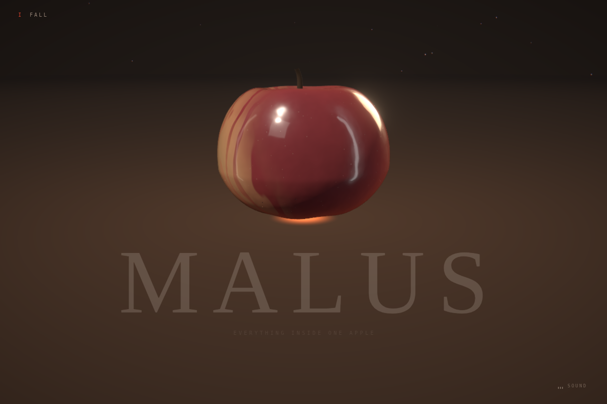
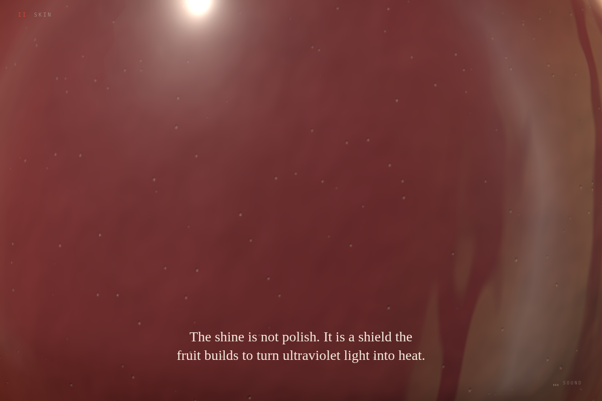
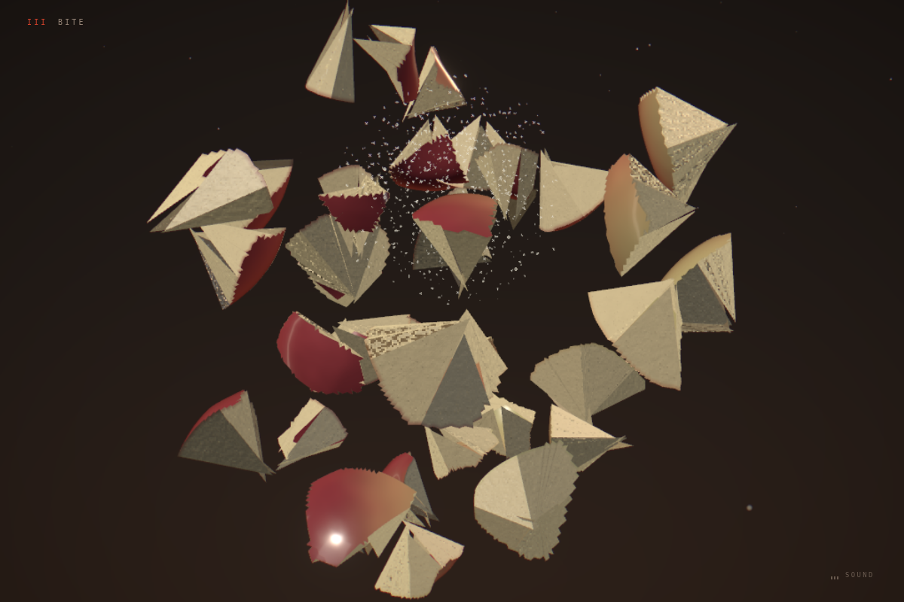
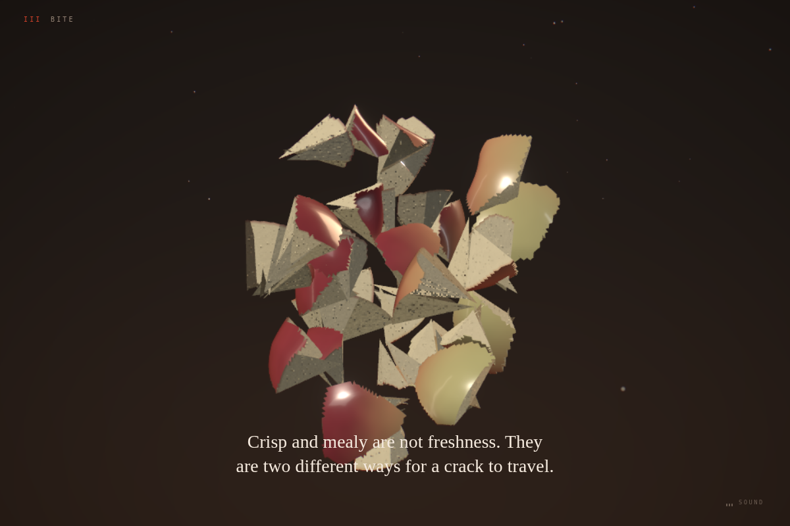
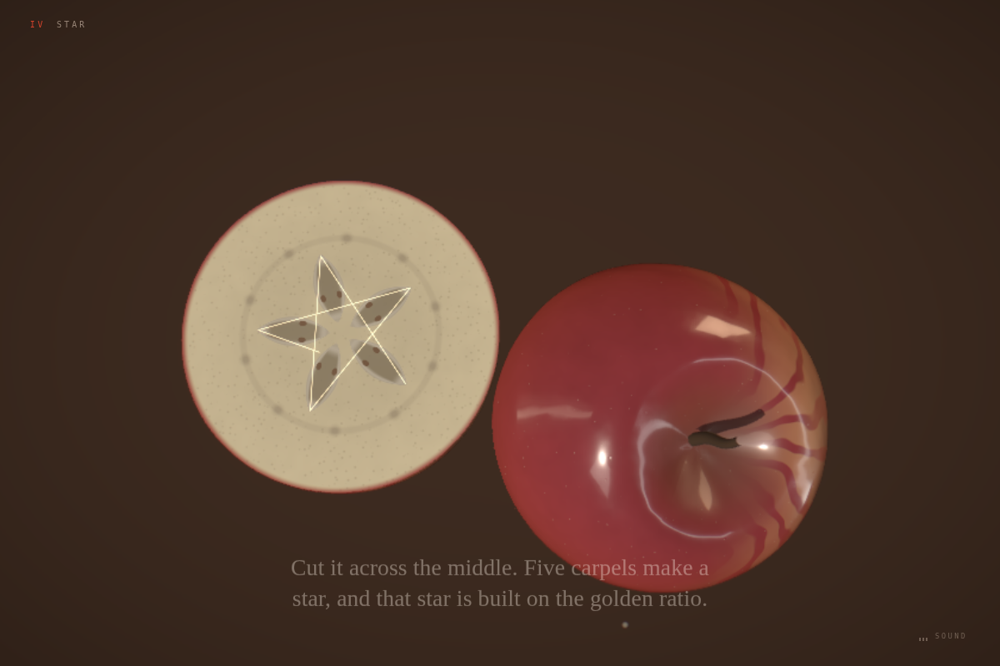
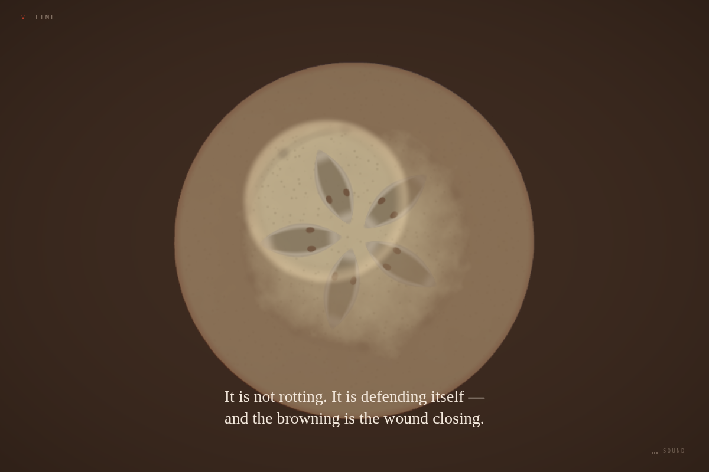
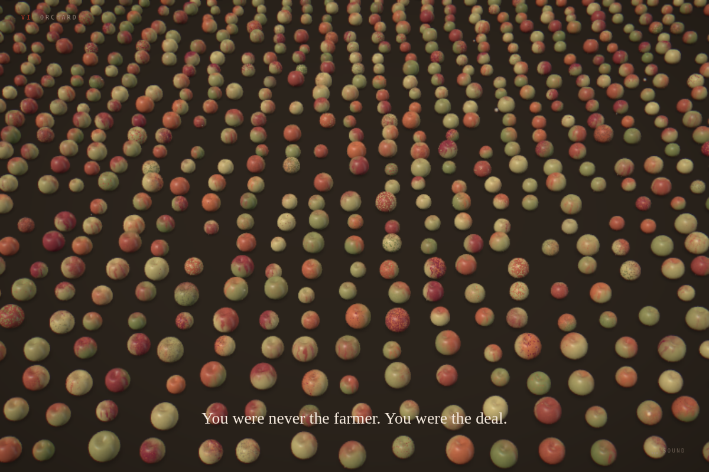
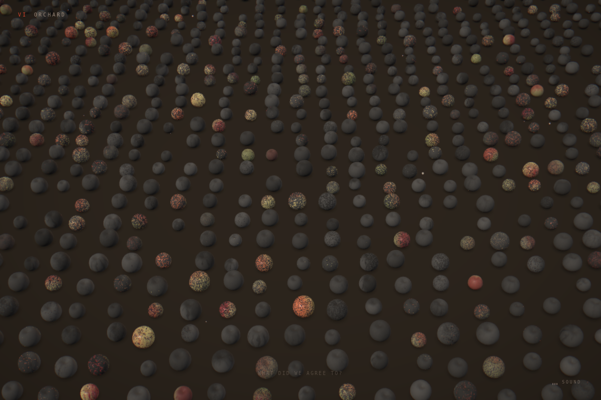

# MALUS

**A 3D essay about an apple. Nothing in it was downloaded.**

Latin `mālus` means apple tree. `malus` means evil. The two words differ only in
a vowel length that Latin stopped writing down — which is very likely why the
unnamed fruit in Genesis became an apple. A pun turned into two thousand years
of iconography.

That is the thesis: the apple is the most ordinary object in the world, and it
is full of things you were never told.

---

## The idea

Most 3D showcases pick a subject that is already impressive — a spaceship, a
supercar, a fantasy city. The subject does half the work.

This one takes the least impressive object available and tries to earn the same
reaction anyway. Seven acts, one fruit, and a rule that every act has to correct
exactly one thing you believed.

The research came first. Before a line of shader code, 228 papers were pulled
from arXiv and OpenAlex across three axes — material rendering, perception
psychology, and the botany and chemistry of the fruit. Three findings changed
the design outright.

**1. Gloss has dedicated neurons.** Cells in the inferior temporal cortex are
selectively tuned to gloss along exactly three physical reflectance parameters:
specular reflectance, diffuse reflectance, and the spread of the specular lobe.
So the skin shader exposes those three by name — `uRhoS`, `uRhoD`, `uAlpha` —
instead of "roughness" and "metalness", and act II sweeps them **one at a time**.
You watch an apple become glossy, which is something nobody has seen, because in
life all three arrive at once.

**2. Crisp and mealy are not freshness.** They are two different ways for a crack
to travel. In a crisp apple the fracture runs *through* the cells, which burst
under turgor pressure and release juice. In a mealy one it runs *between* them,
along the middle lamella, leaving the cells intact and dry. Act III breaks the
same fruit both ways so you can see it — and the sound follows, because it is
the same physics.

**3. Domestication ran the other way.** It is best modelled as a natural
evolutionary response to herbivory: plants recruited humans as seed dispersers.
The apple got sweet, large and red because that attracted a species that would
carry it across continents. It was a trade — sugar for distribution.

> You were never the farmer. You were the deal.

That is the turn the second half is built on, and it is why the act about lost
cultivars lands as a broken bargain rather than as nostalgia.

---

## The seven acts

| | Act | What happens |
|---|---|---|
| I | **FALL** | Scrolling *is* gravity — distance falls with the square of scroll, so speed rises linearly. The apple accelerates because you do. |
| II | **SKIN** | Macro on the cuticle while the three gloss parameters come up one by one. Then ultraviolet arrives and is *absorbed*, not reflected: the shine is a shield. |
| III | **BITE** | The fruit breaks, runs backwards into a whole apple, and breaks again — crisp, then mealy. Real-time fracture, written from scratch. |
| IV | **STAR** | Chaos then order. The same fruit opened slowly along one plane: five carpels, a vascular ring, and a figure that closes exactly. |
| V | **TIME** | The cut face browns. It is not rot — polyphenol oxidase is a wound response. A drop of ascorbic acid turns it back. |
| VI | **ORCHARD** | Thousands of individually distinct apples, planted in rows. Then it goes out, fruit by fruit, and a handful never do. |
| VII | **SEED** | The loop closes on a single point of light that turns out to be a pip. |


*Act I — the landing, and the title arrives with it*


*Act II — the cuticle at macro range, lenticels and a travelling highlight*

| | |
|---|---|
|  |  |
| *Act III — a crisp break: fast, wet, juice released* | *Act III — a mealy break: slow, dry, crumbling* |


*Act IV — one half open, one half skin up; the figure drawn between the carpel tips*

| | |
|---|---|
|  |  |
| *Act V — browning, and the patch the acid reached* | *Act VI — every fruit a different fruit* |


*Act VI — and then it goes out*

---

## Nothing was downloaded

The rules require participants to hold the rights to every asset they include.
This project resolves that by not having any.

- **The apple's shape** is a deformed icosphere: a silhouette profile, a
  five-lobe modulation from the five carpels, two cavities placed as functions of
  distance from the axis, and gradient noise for the lopsidedness no real fruit
  is without. Seeded — which is what makes act VI's thousands of distinct apples
  possible at all.
- **The skin** is GLSL: an anthocyanin blush over a yellow-green ground colour
  (not a gradient between them — that produces a peach), varietal striping that
  only exists in the transition band where real striping lives, lenticels from a
  cellular noise field, russeting in the cavities, and derivative-based relief so
  highlights wobble as they travel.
- **The fracture** is written from scratch. Surface partitioned into Voronoi
  cells seeded toward the strike, each closed by facets running to jittered
  interior apexes, and every fragment's rigid motion computed in the vertex
  shader — one draw call, no solver, and the whole break scrubs backwards.
- **The sound** is synthesised. The crunch is granular because a real one is: a
  bite is not one event but a burst of cell walls rupturing, so it is a cloud of
  micro-impulses whose centre frequency, attack, decay and density all move
  together with turgor.
- **The lighting** is a lightformer rig baked into a procedural environment map.
  No HDRI, no CDN, nothing to go missing on deploy.
- **The noise** is written from the definition rather than pulled from a library,
  so even that carries no obligation.

One consequence worth naming: `three-pinata`, the obvious off-the-shelf answer
for mesh fracture, has no licence file — which makes it all-rights-reserved and
unusable here. That turned out for the better, because an off-the-shelf shatter
cannot express the crisp/mealy distinction the act exists for.

---

## Built with

- **[three.js](https://github.com/mrdoob/three.js)** · **[React Three Fiber](https://github.com/pmndrs/react-three-fiber)** · **[drei](https://github.com/pmndrs/drei)** — scene graph
- **[three-custom-shader-material](https://github.com/FarazzShaikh/THREE-CustomShaderMaterial)** — injecting custom shaders into a physically based material so they keep real image-based lighting
- **[postprocessing](https://github.com/pmndrs/postprocessing)** — bloom, chromatic aberration, vignette
- **[Lenis](https://github.com/darkroomengineering/lenis)** — the scroll spine
- **Web Audio** — procedural crunch and drone, no files
- **[Zustand](https://github.com/pmndrs/zustand)** · **Vite** · **React** · **TypeScript**
- **[Playwright](https://playwright.dev)** with SwiftShader — headless WebGL 2.0, so the scene could be looked at during development rather than guessed at

Built with **Claude Opus** as the developer. That is part of the point: the
author does not write shader code. And the interesting part is not that it
compiled — it is how much of the work was *looking*. A floor accidentally
parented to the falling apple, and therefore slicing the fruit in half at its own
equator, looks completely correct in source.

---

## Running it

```bash
cd app
npm install
npm run dev      # http://localhost:5273
```

Tools, all of which were used to build this rather than added afterwards:

```bash
node tools/shot.mjs <url> out.png --scroll 0.09   # capture any point on the spine
node tools/sweep.mjs shots/sweep                  # every act, one session, end-to-end check
node tools/perf.mjs                               # startup cost and frame time
node tools/audiocheck.mjs                         # sound, which a screenshot cannot show
```

---

## Performance

Measured, not assumed — `tools/perf.mjs`, against the production build.

| | before | after |
|---|---|---|
| Heap at startup | 133 MB | 17 MB |
| Canvas present | — | 133 ms |
| Act VI frame cost | baseline | ~2× faster |

Identical apple geometries are shared, heavy acts mount one act ahead of the
reader rather than all building at load, and pixel density adapts under load.
Quality tiers scale subdivision, fragment count and orchard population.

---

## On the facts

Every claim on the site traces to a paper in the local research library, and
`BRIEF.md` records which finding drives which act.

Claims that are widely repeated but were **not** verifiable in that library —
apple cultivar counts, the extinction rate, "apples are 25% air", the gene-count
comparison with the human genome — are listed in `BRIEF.md` under *Ungeprüft* and
are kept off the site. Act VI shows the orchard going dark and puts no number on
it, for exactly that reason. One line was cut from act IV during the build for
gesturing at witch-trial history that appears in no source; the pentagram's
golden-ratio proportion replaced it, because that is provable geometry rather
than a claim about the world.

On a page that presents itself as scientific, one wrong number costs more than
the fact is worth.

---

## Licence

MIT. See [LICENSE](LICENSE).
